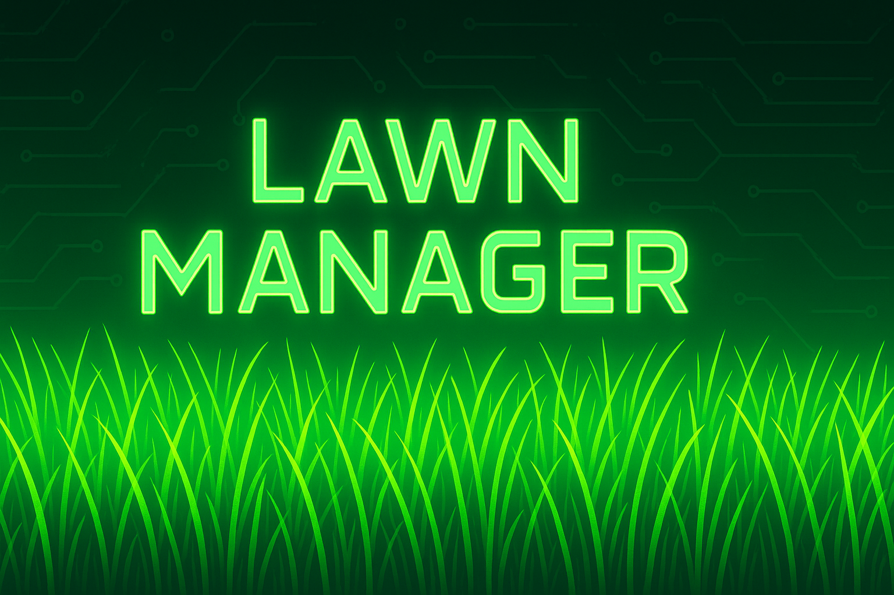

# Lawn Manager - Home Assistant Integration

A comprehensive Home Assistant integration for intelligent lawn care management with **professional-grade chemical calculations**, **multi-zone tracking**, **equipment management**, and **smart notifications**. Now with **perfect zone isolation** and **enhanced chemical calculations** for liquid and granular applications!

## 🚀 Quick Installation

### Easy Installation via HACS

[](https://my.home-assistant.io/redirect/hacs_repository/?owner=tpdean93&repository=Lawn_Manager&category=integration)

**Or manually add via HACS:**
1. Go to HACS → Integrations
2. Click the 3-dot menu → Custom repositories
3. Add: `https://github.com/tpdean93/Lawn_Manager`
4. Category: Integration
5. Install "Lawn Manager"
6. Restart Home Assistant
7. Go to Settings → Devices & Services → Add Integration
8. Search for "Lawn Manager" and configure

### Manual Installation
1. Download the latest release
2. Copy `custom_components/lawn_manager/` to your Home Assistant `custom_components/` directory
3. Restart Home Assistant
4. Add the integration via Settings → Devices & Services

## 🆕 Latest Updates (v1.0.1+)

### 🎯 Perfect Multi-Zone Support
- **Zone Isolation**: Front Yard and Back Yard now have completely separate data storage
- **Zone-Specific Sensors**: Chemical sensors show zone names (e.g., "Front Yard T-Nex (Applied Today)")
- **Independent Tracking**: Chemical applications logged in one zone don't appear in other zones
- **Shared Equipment**: Equipment inventory shared across all zones for convenience

### 🧪 Enhanced Chemical Calculations
- **Liquid vs Granular Detection**: Automatically detects application type based on equipment and chemical data
- **Accurate Chemical Rates**: Fixed T-Nex, Disease Preventer, Insecticide, and Soil Conditioner calculations
- **Method-Specific Calculations**: Liquid rates for sprayers, granular rates for spreaders
- **Rich Sensor Data**: Sensors now show total amounts needed, application type, and zone information

### 🔧 Equipment & UI Improvements
- **Smart Equipment Defaults**: Equipment Selection now defaults to actual equipment instead of "None"
- **Multi-Zone Configuration**: Clear messaging that equipment is shared across all zones
- **Integration Icon**: Custom logo now displays properly in Home Assistant integrations list
- **Enhanced Logging**: Better debugging and calculation visibility

## 🌟 Major Features

### 🧪 Professional Chemical Calculations
- **Accurate Application Rates**: Based on manufacturer specifications for 10+ chemicals
- **Equipment-Specific Mixing**: Custom mixing instructions for your exact equipment
- **Kitchen Measurements**: Cups, tablespoons, and teaspoons for easy measuring
- **Water Requirements**: Proper dilution ratios (e.g., T-Nex: 0.25 oz per gallon)
- **Zone-Based Calculations**: Uses your specific lawn size for precise amounts

### 🔧 Equipment Management System
- **Multi-Step Setup**: Guided configuration flow for zones and equipment
- **Equipment Inventory**: Track sprayers, spreaders, and their capacities
- **Dynamic Dropdowns**: Equipment selection in services updates automatically
- **Smart Entity Creation**: Application Method entity intelligently switches to Equipment Selection
- **Smart Defaults**: Equipment Selection now defaults to your actual equipment, not "None"
- **Multi-Zone Friendly**: Clear guidance that equipment is shared across all lawn zones

### 📊 Smart Tracking & Intelligence
- **Mowing Tracking**: Track last mow date and due dates with customizable intervals
- **Chemical Application Tracking**: Monitor fertilizer, herbicide, and other chemical applications
- **Weather Intelligence**: Smart weather-based recommendations for lawn activities
- **Seasonal Intelligence**: Grass-type aware seasonal recommendations and task management
- **Smart Notifications**: Optional mobile notifications for optimal lawn care timing

### 🎯 Enhanced Services
- **Calculate Application Rate**: Professional mixing instructions with kitchen measurements
- **List Calculation Options**: Get available equipment and zones for rate calculations
- **Equipment Management**: Add, delete, and manage your lawn equipment
- **Response-Based Services**: No more log file hunting - get results directly

## 🚀 Quick Start

### Installation
1. **Download Integration**: Copy all files to `config/custom_components/lawn_manager/`
2. **Restart Home Assistant**
3. **Add Integration**: 
   - Go to Settings > Devices & Services 
   - Click "Add Integration"
   - Search for "Lawn Manager"
   - Click to configure

### 🎯 New 3-Step Configuration Flow

#### Step 1: Basic Configuration
- **Zone Name**: "Front Yard", "Back Yard", etc.
- **Location**: Your city/state for seasonal intelligence
- **Lawn Size**: Square footage for accurate calculations
- **Mow Interval**: How often you typically mow (7-14 days)
- **Weather Entity**: Select your weather integration
- **Grass Type**: Choose your specific grass type

#### Step 2: Equipment Collection
- **Add Equipment**: Add multiple pieces of equipment
  - **Type**: Sprayer or Spreader
  - **Brand**: Custom brand name (Ryobi, John Deere, etc.)
  - **Capacity**: Equipment capacity (4 gallons, 50 pounds, etc.)
  - **Units**: Gallons/liters for sprayers, pounds/kg for spreaders
- **Smart Actions**: "Add this equipment and continue adding" or "Skip adding equipment"
- **Live Preview**: See your equipment list as you build it

#### Step 3: Confirmation
- **Summary**: Review all settings and equipment
- **Restart Warning**: Clear instructions to restart Home Assistant
- **Dynamic Services**: After restart, services get custom dropdowns with your equipment

## 🧪 Chemical Application Calculator

### Professional-Grade Calculations with Smart Detection
The integration provides **accurate, manufacturer-based** application rates with **automatic liquid vs granular detection**:

| Chemical | Liquid Rate (Sprayer) | Granular Rate (Spreader) | Notes |
|----------|----------------------|-------------------------|-------|
| **Fertilizer 10-10-10** | - | 10 lbs per 1,000 sq ft | 10% nitrogen - granular only |
| **T-Nex / PGR** | 0.375 oz per 1,000 sq ft | - | Liquid only - 0.25 oz per gallon water |
| **Weed Preventer** | 0.185 oz per 1,000 sq ft | 3.5 lbs per 1,000 sq ft | Pre-emergent timing critical |
| **Iron Supplement** | 2 oz per 1,000 sq ft | 0.75 lbs per 1,000 sq ft | 2 oz per gallon water for liquid |
| **Disease Preventer** | 1.5 oz per 1,000 sq ft | - | Liquid only - temperature sensitive |
| **Insecticide** | 0.75 oz per 1,000 sq ft | 3.0 lbs per 1,000 sq ft | Broad spectrum control |
| **Soil Conditioner** | 3.0 oz per 1,000 sq ft | 2.0 lbs per 1,000 sq ft | Humic acid - improves soil structure |
| **Urea** | - | 1.6 lbs per 1,000 sq ft | 46-0-0 nitrogen - granular only |
| **Grub Killer** | - | 3.0 lbs per 1,000 sq ft | Curative treatment - granular only |

### 🤖 Smart Application Detection
- **Sprayer + Liquid Data Available** = Liquid application with oz/1000 sqft rates
- **Spreader Selected** = Granular application with lb/1000 sqft rates  
- **Dual-Rate Chemicals** = Automatically chooses correct rate based on equipment
- **Enhanced Sensor Data** = Shows application type, total amounts needed, and zone information

### 🥄 Kitchen Measurements
Get mixing instructions in **kitchen-friendly measurements**:

**Example (T-Nex, 5,000 sq ft, 4-gallon sprayer):**
```
Total needed: 1.875 oz (3.8 tbsp)
Mix 1.0 oz per 4-gallon tank (2.0 tbsp or 1/8 cup)
Per gallon: 0.25 oz (0.5 tbsp per gallon)
```

### 🎯 Using the Calculator
1. **Run Service**: `lawn_manager.calculate_application_rate`
2. **Select Chemical**: Choose from dropdown
3. **Select Equipment**: Your equipment appears in dropdown
4. **Select Zone**: Your zones appear in dropdown
5. **Get Results**: Professional mixing instructions with kitchen measurements

## 🔧 Equipment Management

### Smart Equipment System
- **Automatic Entity Creation**: Equipment Selection entity replaces Application Method
- **Dynamic Dropdowns**: Services automatically include your equipment
- **Capacity-Aware Calculations**: Mixing instructions based on your exact equipment
- **Equipment Storage**: Persistent equipment inventory across restarts

### Equipment Types Supported
**Sprayers:**
- Backpack sprayers (gallons/liters)
- Tank sprayers (gallons/liters)
- Hand-held sprayers (gallons/liters)

**Spreaders:**
- Broadcast spreaders (pounds/kg)
- Drop spreaders (pounds/kg)
- Hand-held spreaders (pounds/kg)

### Equipment Services
- **Add Equipment**: `lawn_manager.add_equipment`
- **Delete Equipment**: `lawn_manager.delete_equipment`
- **List Options**: `lawn_manager.get_equipment_options` (with response)
- **Calculate Rates**: `lawn_manager.calculate_application_rate` (with response)

## 📱 Smart Notifications (Optional)

Get intelligent mobile notifications for optimal lawn care timing!

### Available Blueprints
- **Smart Notifications**: Advanced notifications with weather intelligence and seasonal awareness
- **Basic Notifications**: Simple overdue alerts and good weather notifications

### Notification Types
- 🚨 **Mowing Overdue**: High priority alerts when mowing is overdue
- 🌱 **Good Weather**: Notifications when conditions are perfect for lawn activities
- 🌿 **Chemical Opportunities**: Optimal timing for fertilizer and herbicide applications
- ⛈️ **Weather Alerts**: Rain warnings for recent chemical applications
- 📅 **Seasonal Tasks**: High priority seasonal lawn care reminders
- 🌡️ **Temperature Alerts**: Heat/cold warnings for lawn activities

See [NOTIFICATIONS.md](NOTIFICATIONS.md) for detailed setup instructions.

## 🧠 Seasonal Intelligence

### Grass Type Support
- **Warm Season**: Bermuda, Zoysia, St. Augustine, Centipede
- **Cool Season**: Fescue, Kentucky Bluegrass, Ryegrass, Fine Fescue

### Smart Recommendations
- **Seasonal Mowing Frequency**: Adjusts based on grass type and growing season
- **Chemical Timing**: Seasonal recommendations for pre-emergent, fertilizer, etc.
- **Temperature Warnings**: Heat stress and cold weather alerts
- **Application History**: Smart recommendations based on your actual application history

## 🌦️ Weather Intelligence

### Weather-Based Features
- **Recent Rain Detection**: Checks last 6 hours for rain/high humidity
- **Future Rain Forecasting**: Looks ahead 2-6 hours for rain
- **Drying Time Logic**: Ensures grass is dry before mowing recommendations
- **Chemical-Specific Logic**: Different weather requirements for fertilizers vs herbicides

### Smart Recommendations
- "Good conditions - no rain for 2 days, grass should be dry"
- "Rain expected in 1.2 hours - wait or finish quickly"
- "Light rain expected in 4 hours will help fertilizer absorption"

## 🛠️ Services Reference

### Core Services
```yaml
# Log mowing activity
service: lawn_manager.log_mow
data:
  application_date: "2024-01-15"  # Optional, defaults to today

# Log chemical application
service: lawn_manager.log_application
data:
  chemical_select: "Fertilizer 10-10-10"
  method: "Sprayer"  # or "Spreader"
  application_date: "2024-01-15"  # Optional

# Calculate application rates
service: lawn_manager.calculate_application_rate
data:
  chemical: "T-Nex / PGR"
  equipment_name: "Ryobi 4 Gallon Sprayer"
  zone: "Front Yard"
```

### Equipment Services
```yaml
# Add equipment
service: lawn_manager.add_equipment
data:
  equipment_type: "sprayer"
  brand: "Ryobi"
  capacity: 4
  capacity_unit: "gallons"

# Get equipment options (with response)
service: lawn_manager.get_equipment_options

# Get zone options (with response)
service: lawn_manager.get_zone_options

# List calculation options (with response)
service: lawn_manager.list_calculation_options
```

### Utility Services
```yaml
# Reload integration
service: lawn_manager.reload

# Refresh equipment entities
service: lawn_manager.refresh_equipment_entity
```

## 📊 Example Sensor Output

### Mow Due Sensor
```yaml
State: 2  # Days since last mow
Attributes:
  last_mow: "2024-01-15"
  days_until_due: -2  # Negative means overdue
  weather_suitable_for_mowing: true
  weather_recommendation: "Good conditions - no rain for 2 days"
  seasonal_recommended_frequency: 7
  seasonal_frequency_reason: "Moderate growing season"
```

### Equipment Selection Entity
```yaml
State: "Ryobi 4 Gallon Sprayer"
Attributes:
  equipment_type: "sprayer"
  capacity: 4
  capacity_unit: "gallons"
  brand: "Ryobi"
  friendly_name: "Ryobi 4 Gallon Sprayer"
```

### Chemical Application Sensor (Enhanced with Zone Names)
```yaml
Name: "Front Yard T-Nex (Applied Today)"
State: 0  # Days since last application
Attributes:
  last_applied: "2025-01-17"
  next_due: "2025-02-10"
  interval_days: 24
  default_amount_oz_per_1000sqft: 0.375
  applied_amount_oz_per_1000sqft: 0.563  # Heavy rate (150%)
  rate_multiplier: 1.5
  rate_description: "Heavy (150%)"
  method: "Sprayer"
  application_type: "liquid"
  lawn_size_sqft: 3000
  total_chemical_needed_oz: 1.688
  yard_zone: "Front Yard"
  weather_suitable_for_application: true
  weather_recommendation: "Perfect conditions - no rain expected"
```

## 💡 Daily Usage

### Professional Chemical Applications
1. **Calculate Rates**: Use `calculate_application_rate` service
2. **Get Mixing Instructions**: Professional instructions with kitchen measurements
3. **Apply Chemicals**: Follow the precise mixing ratios
4. **Log Application**: Record the application for tracking

### Equipment Management
1. **Add Equipment**: Use the config flow or `add_equipment` service
2. **Select Equipment**: Choose from dropdowns in services
3. **Calculate Rates**: Get equipment-specific mixing instructions
4. **Manage Inventory**: Add/remove equipment as needed

### Dashboard Integration
Add sensors to your Home Assistant dashboard:
- **Mow Due Status**: Shows days until/overdue with weather info
- **Equipment Selection**: Choose equipment for applications
- **Seasonal Intelligence**: Current season and priority tasks
- **Weather Conditions**: Suitability for lawn activities
- **Chemical Trackers**: Days since last application

## 🔄 Integration Removal & Cleanup

When you remove the integration, it automatically:
- ✅ **Removes all stored data** (applications, equipment, settings)
- ✅ **Restores services.yaml** to original text field format
- ✅ **Cleans up equipment storage**
- ✅ **Removes all entities** and sensors

## ❓ FAQ

**Q: How accurate are the chemical calculations?**
A: All rates are based on manufacturer specifications and professional lawn care standards. Rates include proper dilution ratios and application methods.

**Q: Can I use kitchen measurements instead of ounces?**
A: Yes! The calculator provides cups, tablespoons, and teaspoons for easy measuring. For example, 1 oz = 2 tbsp = 6 tsp.

**Q: What if my equipment isn't in the brand list?**
A: The brand field is now a text input - you can enter any brand name (John Deere, Craftsman, etc.).

**Q: Do I need to restart Home Assistant after adding equipment?**
A: Yes, after the initial setup to enable dynamic dropdowns. The config flow will remind you.

**Q: Can I track multiple lawn areas?**
A: Yes! Each integration instance tracks one lawn area with complete data isolation. Add multiple instances for different areas (front yard, back yard, etc.). Chemical applications in one zone won't appear in other zones.

**Q: What if I don't know my grass type?**
A: The integration defaults to Bermuda grass. You can change it later in the configuration.

**Q: How do I get the mixing instructions?**
A: Use the `calculate_application_rate` service with your chemical, equipment, and zone. You'll get professional mixing instructions with kitchen measurements.

**Q: How does equipment work with multiple zones?**
A: Equipment is shared across ALL zones for convenience - you don't need to add equipment for each zone. However, chemical applications are tracked separately per zone, so T-Nex applied in the Front Yard won't show up in Back Yard sensors.

**Q: Why are my chemical calculations showing zeros?**
A: The integration now automatically detects liquid vs granular applications. Make sure you're using the right equipment type (Sprayer for liquids, Spreader for granular) and the chemical supports that application method.

## 🐛 Troubleshooting

### Common Issues
- **Equipment Not Showing**: Reload integration after adding equipment
- **Equipment Defaults to "None"**: This has been fixed - equipment now defaults to your actual equipment
- **Chemical Applications Cross-Contaminating Zones**: This has been fixed - each zone now has completely separate data storage
- **T-Nex/Disease Preventer Showing Zero Amounts**: This has been fixed - liquid chemicals now calculate properly
- **Calculate Rates Not Working**: Ensure you've selected equipment from dropdown
- **Kitchen Measurements Missing**: Check that chemical has liquid rates defined
- **Services Not Updating**: Restart Home Assistant after initial setup
- **Integration Icon Not Showing**: Restart Home Assistant after installation

### Logs
Check Home Assistant logs for:
- `custom_components.lawn_manager` - Integration logs
- Equipment update signals and service responses

## 📁 File Structure

```
lawn_manager/
├── __init__.py                           # Integration setup & cleanup
├── manifest.json                         # Integration metadata
├── config_flow.py                        # 3-step configuration UI
├── const.py                             # Chemical rates & constants
├── sensor.py                            # Main sensor logic
├── binary_sensor.py                     # Binary sensors
├── services.py                          # Service implementations
├── services.yaml                        # Service definitions
├── weather_helper.py                    # Weather intelligence
├── seasonal_helper.py                   # Seasonal intelligence
├── blueprints/                          # Optional notification blueprints
│   ├── lawn_manager_notifications.yaml  # Advanced notifications
│   └── lawn_manager_basic_notifications.yaml # Simple notifications
├── NOTIFICATIONS.md                     # Notification setup guide
└── README.md                           # This file
```

## 🤝 Contributing

Feel free to submit issues and enhancement requests!

## 📄 License

This project is licensed under the MIT License.

---

**Professional lawn care made simple with Home Assistant intelligence!** 🌱

### 🏆 Recent Major Improvements
- ✅ **Perfect Zone Isolation** - Front/Back Yard data completely separate
- ✅ **Enhanced Chemical Calculations** - Liquid vs granular auto-detection  
- ✅ **Smart Equipment Defaults** - No more "None" selections
- ✅ **Zone-Named Sensors** - Clear identification of which zone each sensor belongs to
- ✅ **Rich Application Data** - Total amounts needed, application type, and comprehensive tracking
- ✅ **Multi-Zone Friendly Config** - Clear guidance on equipment sharing

Ready for production use with professional-grade lawn care tracking! 🚀 
